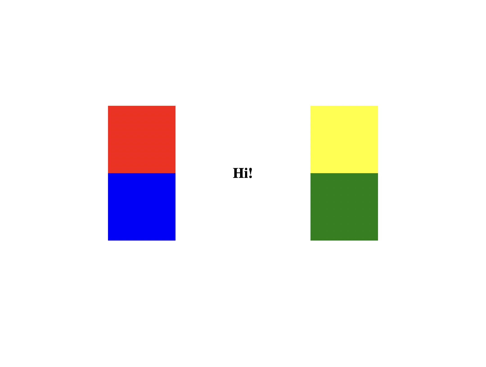

# Project title
Animation assignment

# Tech used
-HTML
-CSS

# Features
When the div main is hovered , each square open up and rotate 90 deg by it's outermost corner.

# Installation 
Install Live Server Extension and click on GO LIVE button at the bottom of the page.

# Screenshot

## An image of the squares when no cursor is hovered on the div main - 

## Image of the colored squares open up when the div main is hovered - 

